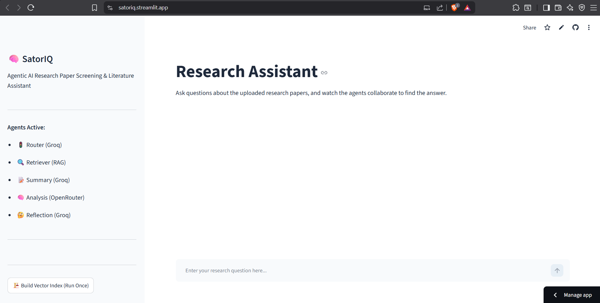
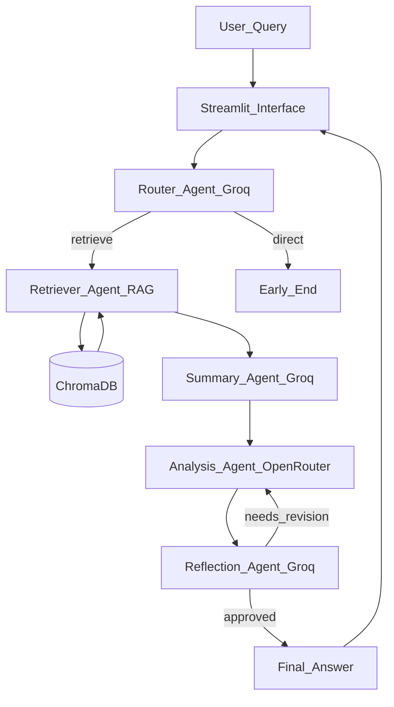
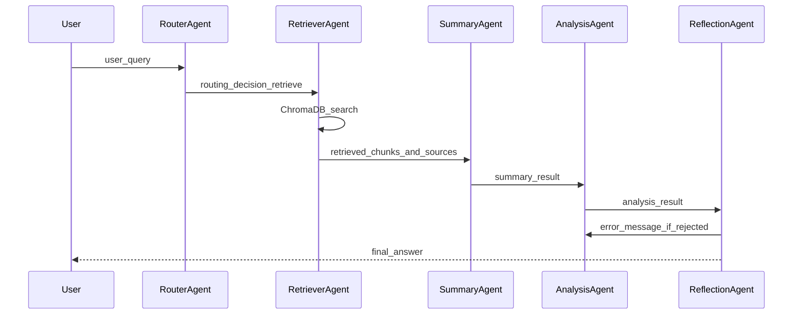

# SatorIQ — Agentic AI Research Paper Screening & Literature Assistant

A multi-agent research literature assistant orchestrated with LangGraph.
Specialists retrieve academic papers from ChromaDB, summarize findings, compare sources, reflect on answer quality, and return a grounded research response.

**Live demo:** https://satoriq.streamlit.app/ 

**GitHub:** https://github.com/NethminaSeeman/SatorIQ

> University assignment project — **educational research assistant demonstration**.



---

## Features

- Multi-agent research pipeline with Router, Retriever, Summary, Analysis, and Reflection agents
- Live LangGraph workflow streaming in Streamlit — watch each agent step in real time
- RAG over 22 academic PDFs on Explainable AI in healthcare (expandable to 20–30 papers)
- ChromaDB + Sentence Transformers (`all-MiniLM-L6-v2`) vector search over chunked research papers
- Dual LLM routing — Groq for fast planning/summary/reflection, OpenRouter for deep analysis
- Reflection loop sends failed answers back to Analysis for self-correction
- One-click **Build Vector Index** sidebar control for PDF ingestion

---

## Quick start (local)

```bash
python -m venv .venv
# Windows:
.\.venv\Scripts\Activate.ps1
pip install -r requirements.txt

copy .env.example .env   # add GROQ_API_KEY and OPENROUTER_API_KEY

# Place 20–30 PDF research papers in data/raw_papers/
streamlit run streamlit_app.py
pytest -q
```

**First run checklist**

1. Add PDFs to `data/raw_papers/` (not committed to git).
2. Open the app → click **Build Vector Index** once in the sidebar.
3. Ask a research question in the chat input.

---

## Architecture



### Agent-to-agent communication

Agents exchange structured data through shared LangGraph state (`GraphState`), not free-form chat.



State contract lives in [`app/agents/state.py`](app/agents/state.py):

| Field | Set by | Purpose |
|-------|--------|---------|
| `user_query` | User / Router | Original or optimized search query |
| `routing_decision` | Router | `"retrieve"` or `"direct"` |
| `retrieved_chunks` | Retriever | Top-k document chunks from ChromaDB |
| `retrieved_sources` | Retriever | Source PDF filenames |
| `summary_result` | Summary | Condensed research findings |
| `analysis_result` | Analysis | Full synthesized answer |
| `reflection_approved` | Reflection | Quality gate boolean |
| `final_answer` | Reflection | Approved response shown to user |
| `error_message` | Reflection | Feedback sent back to Analysis on retry |

Example payloads (conceptual):

```python
# Router → Retriever
{"task": "retrieve", "query": "Explainable AI in healthcare"}

# Retriever → Summary
{"chunks": ["..."], "sources": ["paper1.pdf", "paper2.pdf"]}

# Summary → Analysis
{"summary": "Key findings from retrieved papers..."}

# Analysis → Reflection
{"analysis": "Comprehensive markdown answer..."}

# Reflection → Final
{"approved": True, "answer": "Final approved response..."}
```

---

## Design patterns

| Pattern | Where | Role |
|---------|-------|------|
| **Planning / Router** | [`app/agents/router_agent.py`](app/agents/router_agent.py) | Analyzes query, returns JSON plan, routes to retrieval pipeline |
| **Tool-use** | [`app/agents/retriever_agent.py`](app/agents/retriever_agent.py) | Invokes RAG facade → ChromaDB vector search |
| **Sequential workflow** | [`app/workflow.py`](app/workflow.py) | Retriever → Summary → Analysis → Reflection in fixed order |
| **Reflection** | [`app/agents/reflection_agent.py`](app/agents/reflection_agent.py) | Critiques Analysis output; loops back if incomplete |
| **Orchestrator** | [`app/workflow.py`](app/workflow.py) | LangGraph `StateGraph` coordinates all agents |

---

## Model selection

| Sub-task | Model (provider) | Latency | Cost | Context | Reasoning | Why |
|----------|------------------|---------|------|---------|-----------|-----|
| Router | `llama-3.3-70b-versatile` (Groq) | Very low | Near-free | Enough for JSON routing | Good for structured decisions | Fast entry-point planning |
| Summary | `llama-3.3-70b-versatile` (Groq) | Very low | Near-free | Sufficient for chunk condensation | Good for extraction | Efficient summarization |
| Analysis | `meta-llama/llama-3.1-8b-instruct` (OpenRouter) | Medium | Low | Strong for multi-source synthesis | Higher for comparison | Quality on the reasoning path |
| Reflection | `llama-3.3-70b-versatile` (Groq) | Very low | Near-free | Enough for critique JSON | Good for review tasks | Fast quality gate |

Configured in [`.env.example`](.env.example) / Streamlit secrets.  
**Never use one model for every task** — Groq handles speed-critical steps; OpenRouter handles deep analysis.

Code: [`app/models/groq_client.py`](app/models/groq_client.py), [`app/models/openrouter_client.py`](app/models/openrouter_client.py).

---

## RAG

User questions need **grounded answers** from your local research corpus — not generic LLM knowledge alone.

| Choice | Implementation |
|--------|----------------|
| Corpus | 22 PDF research papers in `data/raw_papers/` (Explainable AI in healthcare) |
| Loader | [`app/rag/loader.py`](app/rag/loader.py) — PyPDFLoader |
| Chunking | [`app/rag/chunker.py`](app/rag/chunker.py) — 1000 chars, 200 overlap |
| Embeddings | `sentence-transformers/all-MiniLM-L6-v2` via HuggingFace |
| Vector store | ChromaDB persisted under gitignored `data/vector_db/` |
| Retriever | Top-k = 4 chunks per query |
| Build | Sidebar **Build Vector Index** or `RAGRetriever().rebuild_index()` |
| Used by | Retriever Agent → shared state → Summary & Analysis |

Code: [`app/rag/retriever.py`](app/rag/retriever.py), [`app/rag/vector_store.py`](app/rag/vector_store.py), [`app/rag/embeddings.py`](app/rag/embeddings.py).

### Retrieval evaluation (5 sample queries)

| # | Query | Expected focus | Observed relevance (manual) |
|---|-------|----------------|-----------------------------|
| 1 | What are the challenges of Explainable AI in healthcare? | XAI clinical adoption papers | High — trust, interpretability, regulation |
| 2 | How does XAI improve clinical decision-making? | Decision-support + transparency | High — clinician trust themes |
| 3 | Compare accuracy vs interpretability in medical AI | Accuracy–interpretability trade-off papers | High — core XAI tension |
| 4 | What role does regulation play in healthcare AI? | Governance / compliance papers | Medium–High — policy framing |
| 5 | Future trends in Explainable AI for Healthcare 5.0 | Survey / roadmap papers | High — trends and opportunities |

Re-run locally after install: first call may download MiniLM weights (cold start on Streamlit Cloud too).

---

## Secrets & deploy

**Local:** copy [`.env.example`](.env.example) → `.env`.

```env
GROQ_API_KEY="your_groq_api_key_here"
OPENROUTER_API_KEY="your_openrouter_api_key_here"
LOG_LEVEL="INFO"
```

**Streamlit Cloud:** paste the same keys into app Secrets. Never commit `.env` or `.streamlit/secrets.toml`.

### Deploy checklist (Streamlit Community Cloud)

1. Push this repo to GitHub: `NethminaSeeman/SatorIQ`.
2. Go to [share.streamlit.io](https://share.streamlit.io) → **New app** → select repo.
3. Main file: `streamlit_app.py`.
4. Branch: `main`.
5. Add secrets (`GROQ_API_KEY`, `OPENROUTER_API_KEY`).
6. Deploy; wait for first build + MiniLM download.
7. Upload PDFs to the deployed environment (or pre-build index locally and document demo flow).
8. Update the **Live demo** link at the top of this README.

---

## Package layout

```text
app/
  agents/       # Router, Retriever, Summary, Analysis, Reflection
  rag/          # loader, chunker, embeddings, vector_store, retriever
  models/       # Groq and OpenRouter client wrappers
  utils/        # workflow helpers
  workflow.py   # LangGraph StateGraph builder
data/
  raw_papers/   # Local PDF corpus (gitignored)
  vector_db/    # ChromaDB persistence (gitignored, built at runtime)
docs/
  images/       # README screenshot (dashboard.png)
diagrams/
  system_architecture.mmd
tests/
  test_rag_pipeline.py
.streamlit/
  config.toml
streamlit_app.py
requirements.txt
```

---

## Docs

- [`diagrams/system_architecture.mmd`](diagrams/system_architecture.mmd) — architecture diagram source

---

## Testing

```bash
pip install -r requirements.txt
pytest tests/ -v
```

Covers chunker output, embedding initialization, and ChromaDB add/search.

---

## Known limitations

- Answers depend on PDFs present in `data/raw_papers/` — empty corpus returns a helpful message, not hallucinated papers.
- PDFs are **not** in git (too large); each environment must load papers locally.
- First embedding model download adds cold-start latency.
- Router may fall back to `"retrieve"` if JSON parsing fails.
- Reflection approves gracefully on LLM errors to avoid infinite loops.
- Streamlit Cloud requires manual PDF upload or a pre-built index strategy for live demos.
- Uses `print()` for agent tracing; production would use structured logging.

---

## Author

**Nethmina Seeman** — [GitHub](https://github.com/NethminaSeeman)

University assignment — Agentic AI + RAG research literature assistant.
